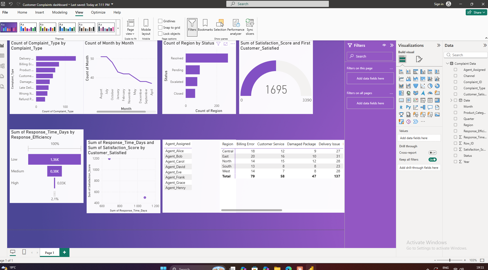

# 📊 Customer Complaint Analytics Dashboard

> A data-driven dashboard built to monitor, analyse, and act on customer complaint trends across regions, agents, channels, and product categories.

---

## 📌 Project Overview

This project transforms raw customer complaint data into an interactive analytics dashboard. The goal is to give operations, customer service, and management teams a single source of truth for understanding complaint volumes, resolution health, agent performance, and customer satisfaction trends.

The dataset contains **500 complaint records** spanning the full year of 2024, across **8 complaint types**, **5 regions**, **5 channels**, **8 agents**, and **8 product categories**.

---

## 🗂️ Dataset

**File:** `Customer_Complaint_Data.xlsx`

| Column | Description |
|---|---|
| `Complaint_ID` | Unique identifier for each complaint |
| `Date` | Date the complaint was logged |
| `Month / Year / Quarter` | Time period breakdowns |
| `Complaint_Type` | Category of the complaint (e.g. Delivery Issue, Billing Error) |
| `Channel` | How the complaint was submitted (Phone, Email, Live Chat, etc.) |
| `Region` | Geographic region of the customer |
| `Product_Category` | Product line associated with the complaint |
| `Agent_Assigned` | Agent who handled the complaint |
| `Status` | Current state: Resolved, Pending, Escalated, or Closed |
| `Response_Time_Days` | Days taken to respond to the complaint |
| `Satisfaction_Score` | Customer rating from 1 (lowest) to 5 (highest) |
| `Customer_Satisfied` | Binary Yes/No satisfaction indicator |
| `Response_Efficiency` | Categorical efficiency rating: Low, Medium, High |

---

## 📈 Dashboard Visuals

The dashboard is composed of **13 visuals** designed to cover volume, performance, trends, and satisfaction analysis:

### Volume & Distribution
| # | Visual Type | What It Shows |
|---|---|---|
| 1 | Bar Chart | Complaints by Type |
| 5 | Horizontal Bar Chart | Complaints by Channel |
| 6 | Treemap | Product Category → Complaint Type breakdown |

### Resolution & Status
| # | Visual Type | What It Shows |
|---|---|---|
| 2 | Donut Chart | Complaint Status Breakdown (Resolved / Pending / Escalated / Closed) |
| 4 | Stacked Bar Chart | Complaints by Region & Status |
| 12 | Grouped Bar Chart | Complaint Status by Quarter |

### Time Trends
| # | Visual Type | What It Shows |
|---|---|---|
| 3 | Line Chart | Monthly Complaint Volume Trend |

### Agent & Operational Performance
| # | Visual Type | What It Shows |
|---|---|---|
| 8 | Bar Chart | Average Response Time by Region |
| 9 | Funnel / Bar Chart | Response Efficiency Distribution |
| 11 | Bar Chart | Average Satisfaction Score by Agent |
| 13 | Bar Chart | Average Response Time by Complaint Type |
| Table | Summary Table | Agent-level scorecard (volume, satisfaction, response time, escalations) |
| Matrix | Conditional Matrix | Region × Complaint Type complaint count heatmap |

### Satisfaction
| # | Visual Type | What It Shows |
|---|---|---|
| 7 | KPI Gauge | Overall Customer Satisfaction Rate |
| 10 | Scatter Plot | Response Time vs. Satisfaction Score |
| MSP | Multi-Series Plot | Satisfaction Score & Response Time over time |

---

## 🔍 Key Insights

- **Delivery Issues** are the most common complaint type at 137 cases (27.4% of all complaints)
- **53.2% of customers** are satisfied — leaving nearly half unsatisfied, a critical area for improvement
- **33.2% of complaints** are either Pending or Escalated, signalling resolution bottlenecks
- **Response Efficiency is predominantly Low** (56.2%), highlighting systemic process gaps
- **Refund Problems** take the longest to resolve at an average of 4.16 days
- Agent performance varies, with satisfaction scores ranging from **3.24 to 3.58**

---

## 🛠️ Tools Used

| Tool | Purpose |
|---|---|
| **Microsoft Excel / Power BI** | Primary dashboard and visualisation tool |
| **Python (pandas)** | Data exploration and analysis |
| **Claude AI** | Visual recommendations and insight generation |

---

## 🚀 Getting Started

### Prerequisites
- Power BI Desktop (free) **or** Microsoft Excel with chart capabilities
- Python 3.x with `pandas` and `openpyxl` (optional, for data prep)

### Setup

1. **Clone this repository**
   ```bash
   git clone https://github.com/your-username/customer-complaint-dashboard.git
   cd customer-complaint-dashboard
   ```

2. **Open the data file**
   ```
   Customer_Complaint_Data.xlsx
   ```

3. **Load into Power BI**
   - Open Power BI Desktop
   - Click `Get Data` → `Excel`
   - Select `Customer_Complaint_Data.xlsx` → Load the `Complaint Data` sheet
   - Begin building visuals from the dashboard visual list above

4. **Optional: Run Python analysis**
   ```bash
   pip install pandas openpyxl
   python analyse.py
   ```

---

## 📁 Project Structure

```
customer-complaint-dashboard/
│
├── Customer_Complaint_Data.xlsx   # Raw dataset (500 records)
├── Dashboard.pbix                 # Power BI dashboard file
├── analyse.py                     # Python exploration script (optional)
└── README.md                      # Project documentation
```

---

## 📊 Dashboard Preview


(Add a screenshot of your completed dashboard here)



---

## 🎯 Business Questions Answered

- Which complaint types are most frequent and where are they coming from?
- What percentage of complaints are being resolved vs. escalating?
- Which agents perform best on satisfaction and response time?
- Is there a relationship between how fast we respond and how satisfied customers are?
- Which product categories generate the most complaints?
- Are complaint volumes and escalation rates improving quarter over quarter?

---

## 🤝 Contributing

Pull requests are welcome. For major changes, please open an issue first to discuss what you would like to change.

---

## 📄 License

This project is licensed under the [MIT License](LICENSE).

---


---

*Built with 📊 data, ☕ coffee, and a commitment to better customer experiences.*
